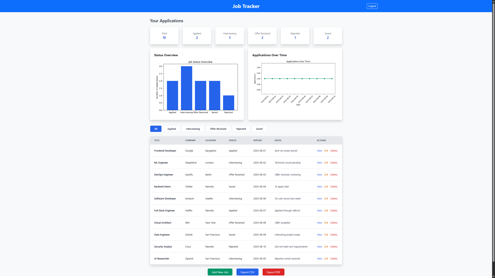
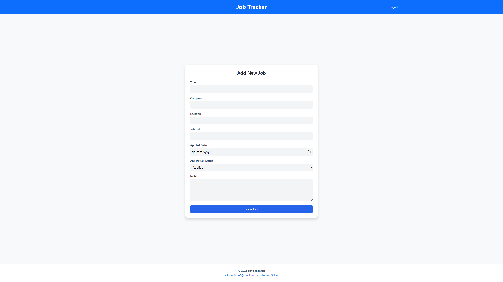
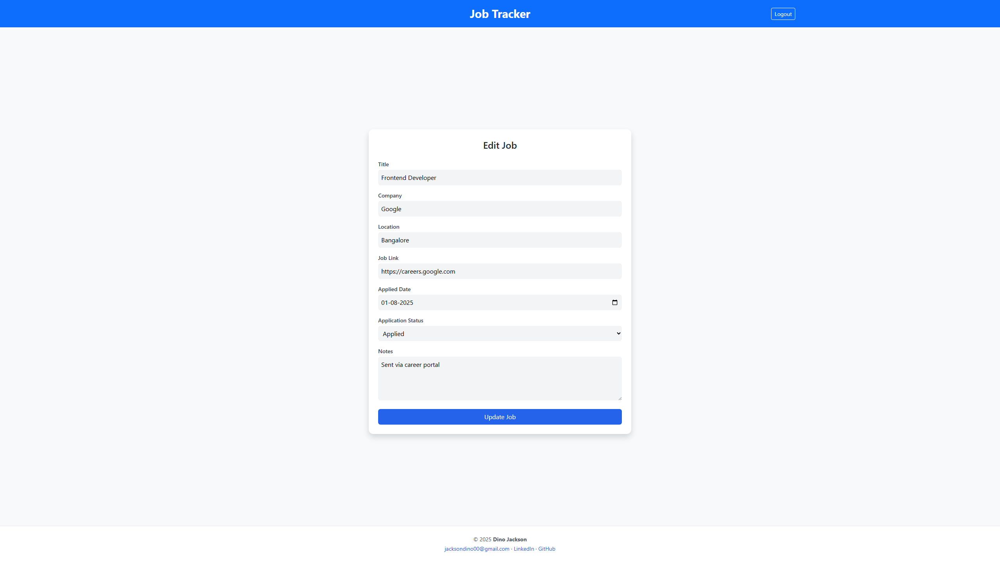
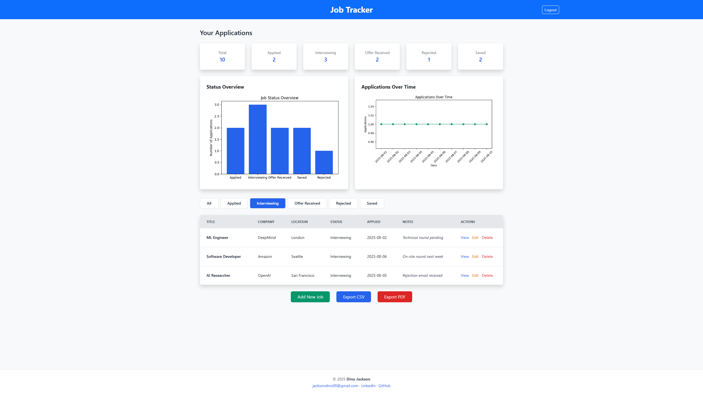
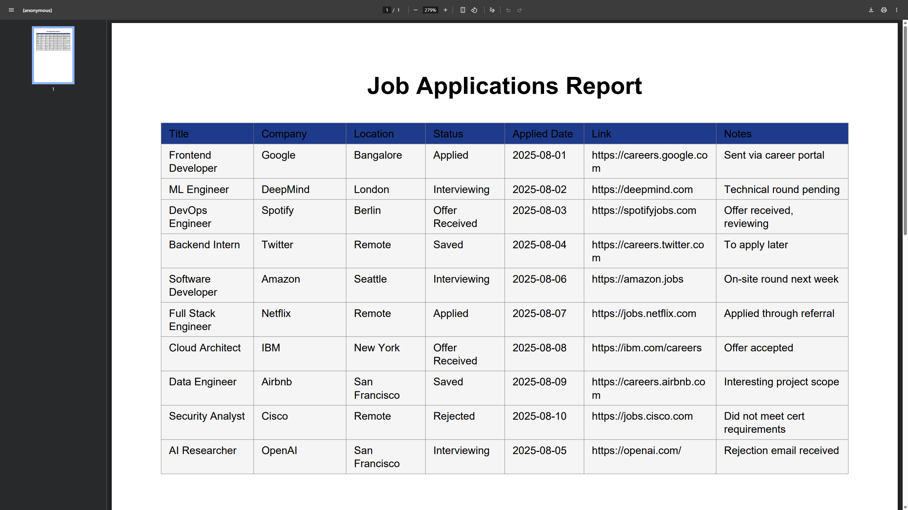

# 💼 Job Tracker — FastAPI App for Managing Job Applications

A FastAPI-powered job tracking platform with JWT authentication, CSV/PDF exports, analytics dashboard, and full Docker support deployable on Render and AWS EC2.

<!-- 🌐 Live Apps -->
[](https://job-tracker-59j1.onrender.com)
[](http://16.171.148.202:8000)

<!-- 🛠️ Tech Badges -->
[](https://www.python.org/)
[](https://fastapi.tiangolo.com/)
[](https://www.docker.com/)
[](https://www.postgresql.org/)
[](https://sqlmodel.tiangolo.com/)
[](https://docs.pytest.org/)

<!-- 📜 Meta Badges -->
[](LICENSE)
[](https://github.com/Dno-J/job-tracker/commits/main)

---


## 🚀 Features

- 📂 **Job Application Management** — Add, edit, delete, and filter applications with status tracking.  
- 🔐 **Secure Authentication** — JWT (HTTP-only cookies), password hashing, and middleware guards.  
- 📊 **Interactive Dashboard** — Charts, quick stats, and trends for fast insights.  
- 📤 **Data Export** — Export applications to CSV or printable PDF (with charts).  
- 🐳 **Dockerized** — Consistent local and cloud environments via Docker.  
- ☁️ **Multi-cloud Deployment** — Deploy on **Render** and **AWS EC2**.  
- 🛡️ **Environment Management** — Safe `.env` templates for local and cloud setups.  
- 🧪 **Testing** — Comprehensive Pytest suite covering CRUD, authentication/security, and export validation. 

---

## 📦 Local Setup

```bash
# Clone the repository
git clone https://github.com/Dno-J/job-tracker.git
cd job-tracker

# Create and populate env file
cp .env.example .env

# Install dependencies
pip install -r requirements.txt

# Run locally
uvicorn main:app --reload
````

---


## ☁️ Deployment

This app is **fully Dockerized** and runs identically on **Render** and **AWS EC2** for maximum flexibility.  
Containerization ensures smooth, repeatable deployments on any host.

---

### 📦 Quick Deployment Flow

```mermaid
flowchart LR
    A[Code Push to GitHub] --> B[Docker Build]
    B --> C[Deploy to Render]
    B --> D[Deploy to AWS EC2]
    C --> E[Live App (Render)]
    D --> F[Live App (EC2)]
```

---

### 🔷 Render

* Deployment configured with `render.yaml` file
* Environment variables managed via Render dashboard or in `render.yaml`
* Database: **Neon Postgres** (or SQLite for local development)
* Automatic builds & deploys triggered on every push to `main` branch

**Live App:** [job-tracker-59j1.onrender.com](https://job-tracker-59j1.onrender.com)

**Setup Commands:**

```bash
# 1. Push your latest code to GitHub
git add .
git commit -m "Deploy to Render"
git push origin main

# 2. Log in to https://render.com and connect your GitHub repo

# 3. Create a new Web Service on Render:
#    - Select your repo and 'main' branch
#    - Use 'Docker' or 'Python' environment (your render.yaml uses python env)
#    - Set environment variables in Render dashboard OR rely on those in render.yaml
#    - Render will auto-build and deploy your app on push

# 4. Monitor build and deployment logs in Render dashboard

# 5. Access your live app via the provided Render URL
```

---

### 🟠 AWS EC2

* Manual Dockerized deployment on your own **AWS EC2** instance
* Environment variables configured via `.env.ec2.template`

**Setup Commands:**

```bash
# SSH into your EC2 instance
ssh ubuntu@<your-ec2-ip>

# Clone your repo
git clone https://github.com/Dno-J/job-tracker.git
cd job-tracker

# Copy and edit env file for production settings
cp .env.ec2.template .env

# Build the Docker image
docker build -t job-tracker-app .

# Run the container, forwarding port 8000 and passing env vars
docker run -d -p 8000:8000 --env-file .env job-tracker-app
```

**Live App:** [http://16.171.148.202:8000](http://16.171.148.202:8000)

---


## 🧪 Running Tests

To run the automated test suite, make sure you have all dependencies installed, then execute:

```bash
pytest
````

The Pytest suite covers:

* CRUD operations (create, read, update, delete)
* Security checks (authentication, authorization)
* Data export verification (CSV, PDF generation)

Tests run against an isolated SQLite database for consistency and speed.

---

## 🛠️ Tech Stack

| Category         | Tools & Frameworks                                       | Purpose                                                |
|------------------|---------------------------------------------------------|--------------------------------------------------------|
| **Backend**      | FastAPI, SQLModel, Pydantic                              | API endpoints, ORM for DB models, request/response validation |
| **Auth/Security**| JWT (HTTP-only cookies), Password hashing, Middleware guards | Secure login, session handling, route protection         |
| **Testing**      | Pytest, Fixtures, Isolated SQLite DB                     | Automated CRUD, security, and export tests with reproducible results |
| **Deployment**   | Docker, Render, AWS EC2, Neon Postgres                   | Cloud hosting, database hosting, containerized builds    |
| **Utilities**    | Jinja2, Matplotlib, WeasyPrint, CSV/PDF export scripts   | Server-side rendering, data visualization, export generation |

---


## 🏗️ Project Structure

For the complete folder and file layout, including descriptions of each component, see [PROJECT_STRUCTURE.md](PROJECT_STRUCTURE.md).

---

## 🖼️ App preview (screenshots)

Below are some key screens of the Job Tracker app in action.  
All images live in `app/static/assets/screenshots/`

### 📋 Dashboard

- The main view of your job applications with quick-glance stats and filters.

### ➕ Add job

- Add a new job entry with title, company, status, and notes; validation ensures clean data.

### ✏️ Edit job

- Update an existing application; preserve history and keep details current.

### 🔍 Filtered results

- Apply search and status filters to narrow results quickly.

### 📤 Export to PDF

- Generate a printable PDF report of your applications.

---

## 📬 Contact 

If you’d like to discuss the project or potential opportunities, you can reach me here:

[](https://www.linkedin.com/in/dino-jackson-486840368)
[](https://github.com/Dno-J)
[](mailto:jacksodino00@gmail.com)

---

## 🤝 License

This project is licensed under the MIT License.

```
MIT License

Copyright (c) 2025 Dino Jackson

Permission is hereby granted, free of charge, to any person obtaining a copy
of this software and associated documentation files (the “Software”), to deal
in the Software without restriction, including without limitation the rights
to use, copy, modify, merge, publish, distribute, sublicense, and/or sell
copies of the Software, and to permit persons to whom the Software is
furnished to do so, subject to the following conditions:

THE SOFTWARE IS PROVIDED “AS IS”, WITHOUT WARRANTY OF ANY KIND, EXPRESS OR
IMPLIED, INCLUDING BUT NOT LIMITED TO THE WARRANTIES OF MERCHANTABILITY,
FITNESS FOR A PARTICULAR PURPOSE AND NONINFRINGEMENT. IN NO EVENT SHALL THE
AUTHORS OR COPYRIGHT HOLDERS BE LIABLE FOR ANY CLAIM, DAMAGES OR OTHER
LIABILITY.
```
<p align="center">
  Built with ❤️ by <strong>Dino Jackson</strong>
</p>

