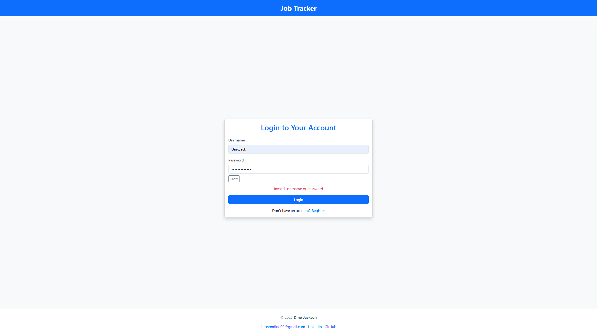

# 💼 Job Tracker — FastAPI App for Managing Job Applications

Track, filter, and export your job hunt with a secure FastAPI backend. Includes JWT auth, PDF/CSV export, charts, and full test coverage.

[](https://job-tracker-59j1.onrender.com)
[](https://www.linkedin.com/in/dino-jackson-486840368)
[](https://github.com/Dno-J)


---

## 🚀 Features

- 🔐 JWT-based authentication with hashed passwords
- 📊 Dashboard view with filters and charts
- ➕ CRUD on job applications (add, edit, delete)
- 🔎 Filter/search by status, company, location, and date
- 📁 Export applications to PDF and CSV
- 🛡️ Middleware-enforced protected routes
- 🧪 Full test suite for auth, CRUD, security, and exports

---

## 🌐 Live demo

[Open the deployed app on Render](https://job-tracker-59j1.onrender.com)

---

## 🖼️ App preview (screenshots)

All images live in app/static/assets/screenshots/.

### 📋 Dashboard

- The main view of your job applications with quick-glance stats and filters.

### ➕ Add job

- Add a new job entry with title, company, status, and notes; validation ensures clean data.

### ✏️ Edit job

- Update an existing application; preserve history and keep details current.

### 🔍 Filtered results

- Apply search and status filters to narrow results quickly.

### 📤 Export to PDF

- Generate a printable PDF report of your applications.

---

## 🔐 Authentication flow

### 🧑‍💻 Signup

- Create an account; passwords are hashed and validated.

### 🔑 Login

- Authenticate via JWT stored in HTTP-only cookies for security.

### 🚫 Invalid credentials

- Clear error messaging and safe failure states prevent information leaks.

---

## 📦 Export functionality

- PDF export: clean, printable summaries of your current/filtered applications.
- CSV export: easy import to spreadsheets or external tools.
- CSV header format:
  ```
  Title,Company,Location,Link,Status,Applied Date,Notes
  ```

---

## 🏗️ Project structure

```plaintext
job-tracker/
├── app/
│   ├── auth/                 # JWT logic, password hashing, auth dependencies
│   ├── middleware/           # FastAPI middleware for route protection
│   ├── models/               # SQLModel ORM models (Job, User)
│   ├── routers/              # FastAPI route handlers (auth, jobs, dashboard, API)
│   ├── schemas/              # Pydantic schemas for request/response
│   ├── static/               # Charts, exports, screenshots
│   │   ├── charts/           # Rendered chart images
│   │   └── exports/          # Generated PDFs (git-kept via .keep)
│   ├── templates/            # Jinja2 HTML templates (dashboard, auth, jobs)
│   ├── tests/                # Pytest suite (CRUD, security, exports)
│   ├── utils/                # CSV/PDF generation, charts, template helpers
│   ├── database.py           # DB engine + session config
│   └── __init__.py
├── .env                      # Local env variables (not committed)
├── .env.example              # Safe template for shared usage
├── config.py                 # Environment and config handling
├── Dockerfile                # Production Docker image config
├── jobtracker.db             # Dev SQLite database
├── main.py                   # FastAPI entrypoint
├── pytest.ini                # Pytest config (e.g., warning filters)
├── render.yaml               # Deployment settings for Render
├── requirements.txt          # Python dependencies
└── test.db                   # Isolated test SQLite database
```

---

## 🧰 Tech stack

| Backend  | Auth/Security        | Testing        | Deployment        |
|----------|-----------------------|----------------|-------------------|
| FastAPI  | JWT (HTTP-only cookie)| Pytest         | Docker + Render   |
| SQLModel | Password hashing      | Isolated DB    | Neon Postgres     |
| Pydantic | Middleware guards     | Fixtures       | Env templates     |

---

## 📦 Local setup

```bash
# Clone repository
git clone https://github.com/Dno-J/job-tracker.git
cd job-tracker

# Create & activate virtual environment
python -m venv .venv
# Windows
.venv\Scripts\activate
# macOS/Linux
# source .venv/bin/activate

# Install dependencies
pip install -r requirements.txt

# Configure env (edit values as needed)
copy .env.example .env   # Windows
# cp .env.example .env   # macOS/Linux

# Run the application (choose one)
python main.py
# or (if you prefer uvicorn)
# uvicorn main:app --reload --host 0.0.0.0 --port 8000
```

---

## 🧪 Testing

```bash
pytest -v --disable-warnings
```

- Uses an isolated test database (`test.db`)
- Covers signup/login, export routes, CRUD operations, and security middleware

---

## 🐳 Docker (Optional)

Build and run the app using Docker:

```bash
# Build the Docker image
docker build -t job-tracker .

# Run the container with port mapping and environment variables
docker run --env-file .env -p 8000:8000 job-tracker
```

---

## 🌐 Deployment

- Hosted on Render using render.yaml
- Environment variables configured on the Render dashboard
- Database: Neon Postgres (or SQLite for local dev)
- Containerized build for reproducibility

[](https://job-tracker-59j1.onrender.com)

---

## 🧭 Roadmap

- [x] CRUD job tracking
- [x] JWT authentication with cookie storage
- [x] PDF/CSV export
- [x] Dashboard + filters
- [ ] Pagination for job listings
- [ ] Import from CSV
- [ ] Optional OAuth login

---

## 👨‍💻 Developer

Built with ❤️ by **Dino Jackson**

[](https://www.linkedin.com/in/dino-jackson-486840368)
[](https://github.com/Dno-J)

---

## 🤝 License

This project is licensed under the MIT License.

```text
MIT License

Copyright (c) 2025 Dino Jackson

Permission is hereby granted, free of charge, to any person obtaining a copy
of this software and associated documentation files (the “Software”), to deal
in the Software without restriction, including without limitation the rights
to use, copy, modify, merge, publish, distribute, sublicense, and/or sell
copies of the Software, and to permit persons to whom the Software is
furnished to do so, subject to the following conditions:

THE SOFTWARE IS PROVIDED “AS IS”, WITHOUT WARRANTY OF ANY KIND, EXPRESS OR
IMPLIED, INCLUDING BUT NOT LIMITED TO THE WARRANTIES OF MERCHANTABILITY,
FITNESS FOR A PARTICULAR PURPOSE AND NONINFRINGEMENT. IN NO EVENT SHALL THE
AUTHORS OR COPYRIGHT HOLDERS BE LIABLE FOR ANY CLAIM, DAMAGES OR OTHER
LIABILITY.
```